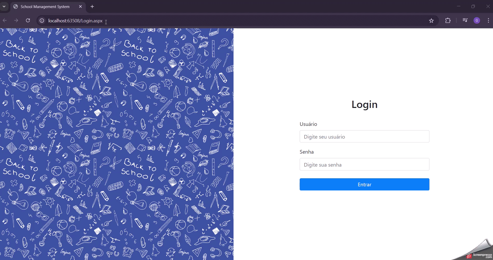

# 🎓 Sistema de Gestão Escolar

Sistema web desenvolvido em **ASP.NET Web Forms** para gerenciamento de dados escolares. Possui autenticação com controle de sessão, dashboard com cards informativos e layout responsivo com Bootstrap.

---
## 🖼️ Demonstração (GIF)

<p align="center">
  
</p>

---
## 🚀 Tecnologias Utilizadas

- ASP.NET Web Forms (.NET Framework)
- C# (CodeBehind)
- SQL Server
- ADO.NET
- Bootstrap 4
- Font Awesome
- HTML5, CSS3 e JavaScript

---

## 📦 Funcionalidades

- 🔐 Login com controle de sessão (um login por vez)
- 📊 Dashboard com contadores informativos
- 🧑 Cadastro e gerenciamento de estudantes
- 🏫 Cadastro de turmas e disciplinas (Subjects & Classes)
- 📋 Cards com ícones personalizados
- 🌄 Imagem de fundo no painel
- 🖼️ Integração com Font Awesome para ícones visuais

---

## 🖥️ Como Executar

1. Clone o repositório:

```bash
git clone https://github.com/seu-usuario/seu-repositorio.git
